# Intelligent Document Processing Solution Accelerator

Many organizations process different format of forms in various format. These forms go through a manual data entry process to extract all the relevant information before the data can be used by software applications. The manual processing adds time and opex in the process. The solution described here demonstrate how organizations can use Azure cognitive services to completely automate the data extraction and entry from pdf forms. The solution highlights the usage of the  **Form Recognizer** and **Azure Cognitive Search**  cognitive services. The pattern and template is data agnostic i.e. it can be easily customized to work on a custom set of forms as required by a POC, MVP or a demo. The demo also scales well through different kinds of forms and supports forms with multiple pages. 

## Architecture

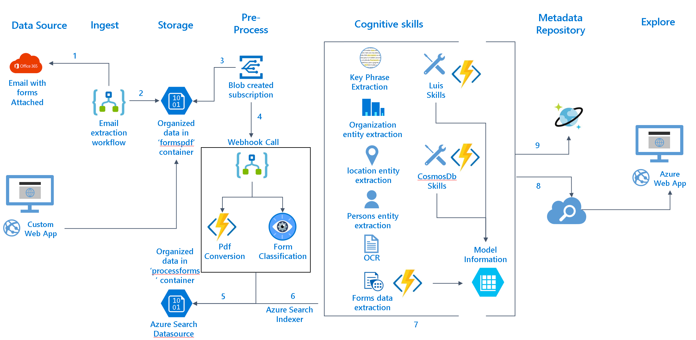 

## Process-Flow

* Receive forms from Email or upload via the custom web application
* The logic app will process the email attachment and persist the PDF form into blob storage
  * Uploaded Form via the UI will be persisted directly into blob storage
* Event grid will trigger the Logic app (PDF Forms processing)
* Logic app will
  * Convert the PDF (Azure function call)
  * Classify the form type using Custom Vision
  * Perform the blob operations organization (Azure Function Call)
* Cognitive Search Indexer will trigger the AI Pipeline
  * Execute standard out of the box skills (Key Phrase, NER)
  * Execute custom skills (if applicable) to extract Key/Value pair from the received form
  * Execute Luis skills (if applicable) to extract custom entities from the received form
  * Execute CosmosDb skills to insert the extracted entities into the container as document
* Custom UI provides the search capability into indexed document repository in Azure Search

## Deployment

### STEP 0 - Before you start (Pre-requisites)

These are the key pre-requisites to deploy this solution:

1. Download the PowerBI application and have it installed on your PC.

2. Go to **https://portal.azure.com/**, search and select **Cognitive services multi-service account**.

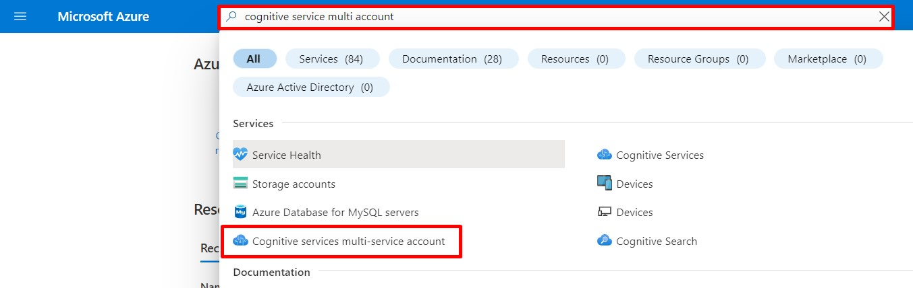 

3. In the **Cognitive Services | Cognitive services multi-service account** page, click on **+ Create**

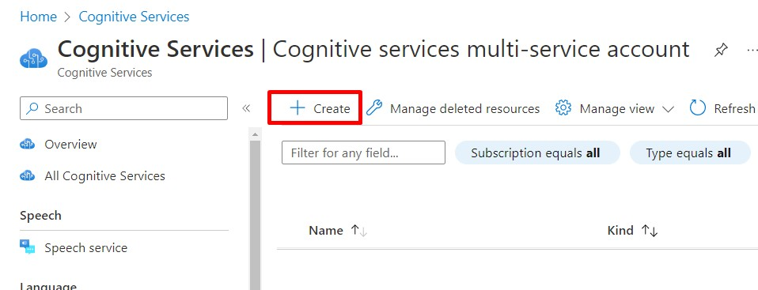

4. In the **Create Cognitive Services** page, provide the detais for creating the cognitive services account.

i) Subscription: Select the subscription you would like to use. ***(1)***

ii) Resource group: Create or Select the resource group with name **Intelligent**. ***(2)***

iii) Region: Select the region **East US** or **South Central US**. ***(3)***

iv) Name: Provide the name to the cognitive services account with the naming convention "**idp<** **Enter-any-6-digits >cs**". ***(4)***. For example: **idp012345cs**

v) Pricing tier: Select the available pricing tier **Standard S0**. ***(5)***

vi) Agree to the **Responsible AI Notice** terms by checking the box. ***(6)***

Once the details are provided, click on **Review + Create**. ***(7)***

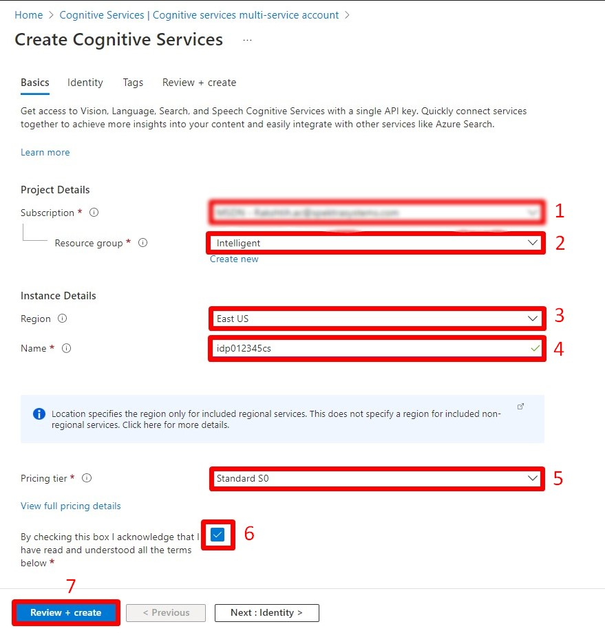

5. Wait for the validation to complete. Then, click on **Create**.

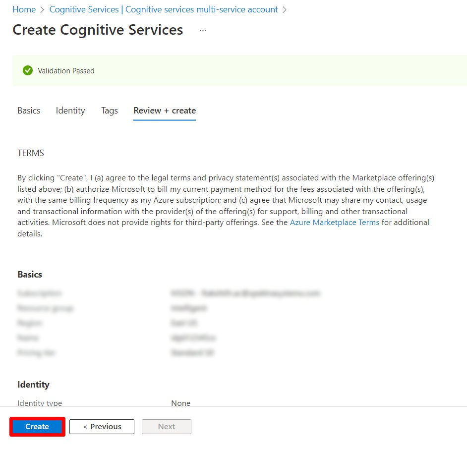

6. From the GitHub repo **https://github.com/CloudLabsAI-Azure/Solution-Accelerators/tree/main/Intelligent-Document-Processing**, copy the entire **setup-script.ps1** script from the **CloudLabsAI-Azure/Solution-Accelerators** repo's **Intelligent-Document-Processing** folder.

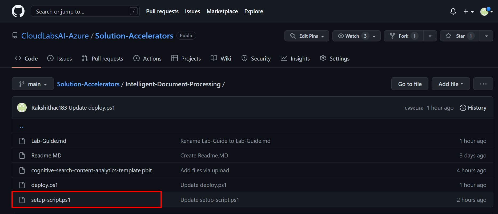

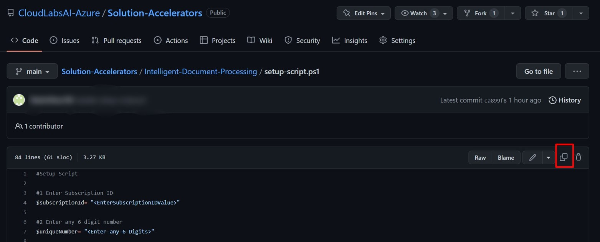

7. Open **Powershell ISE** as an **Administrator** and paste the entire **setup-script.ps1** script.

8. In the script, add the same values that we used to create Congitive services account for **$subscriptionId** ***(1)*** and **$uniqueNumber** ***(2)*** within the double quotes. Also, update the region name in **$location** ***(3)*** if required. 

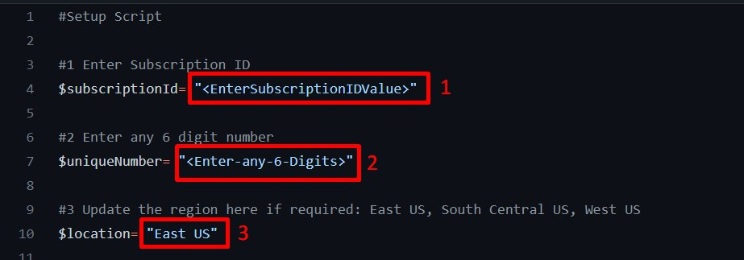

9. Execute the **setup-script.ps1** script. This will download all the dependencies in the **D:\LabFiles** directory and will start deploying the resources.

10. When you receive an Azure login popup, provide your Azure credentials to login. If you had previously logged in through PowerShell, then you will be prompted to select your account. Please select your account in this case.

 
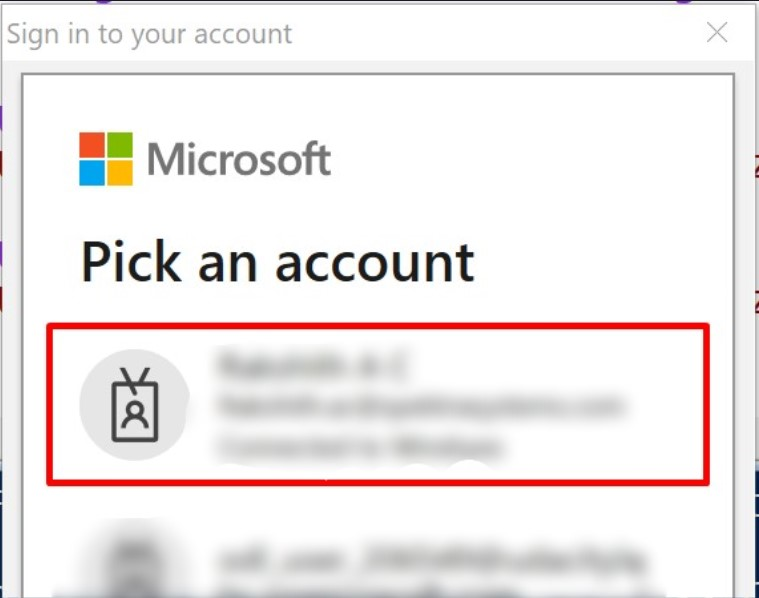

11. Wait for 5 minutes, then got to **portal.azure.com** and open the **Intelligent** resource group that we will use for the rest of this demo.

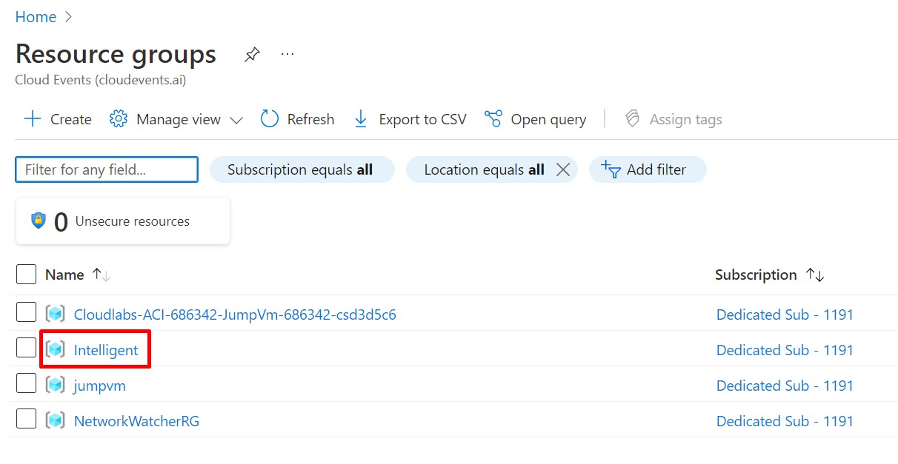

12. Go back to the PowerShell window and wait for a few minutes as we manually need to authorize two API connections.

### STEP 1 - Authorize Event Grid API Connection

**Note: Consider the 6 digit unique number you entered whereever you see <$uniqueNumber>**

1. Wait for the step in the script that states **STEP 12 - Create API Connection and Deploy Logic app**.

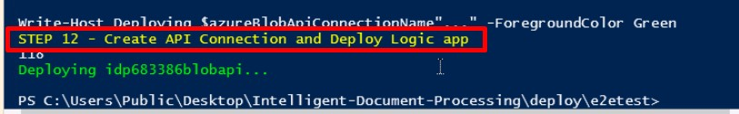

2. We need to authorize the API connection in two minutes. Once you see the message **Authorize idp<$uniqueNumber>aegpi API Connection** in yellow, go to **Intelligent** resource group. 

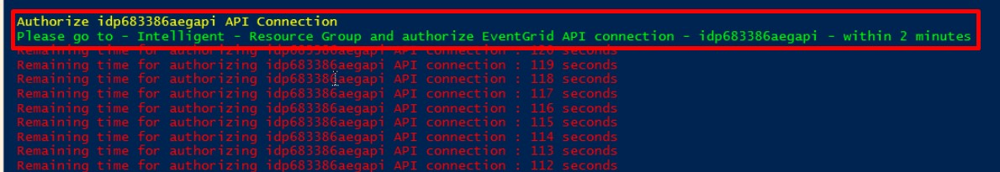

3. Search for the **idp<$uniqueNumber>aegapi** resource in the search tab and click on it. This will now take you to a API connection page. 

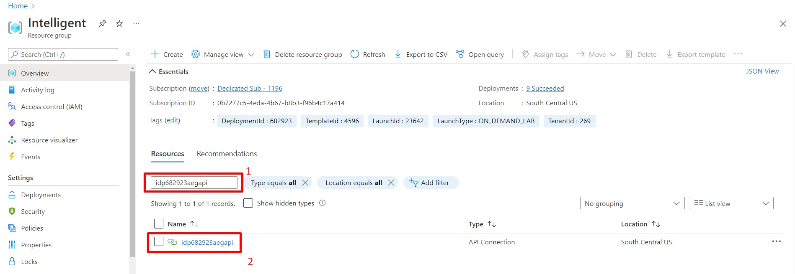

4. In the API connection blade, select **Edit API connection**. 

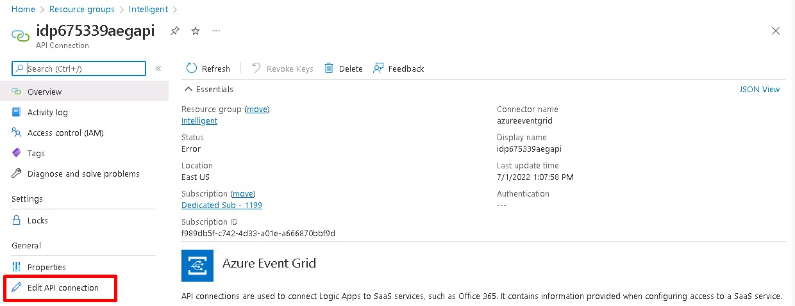

5. Click on **Authorize** button to authorize. 

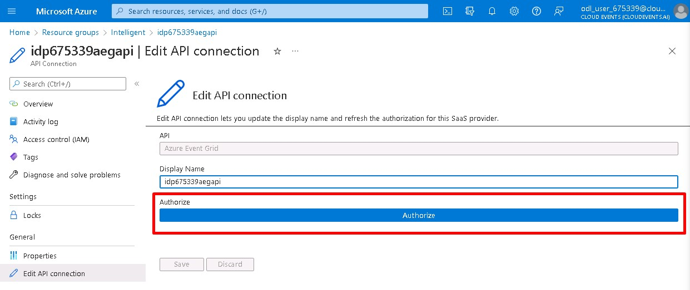

6. In the new window that pops up, select the ODL/lab account. 

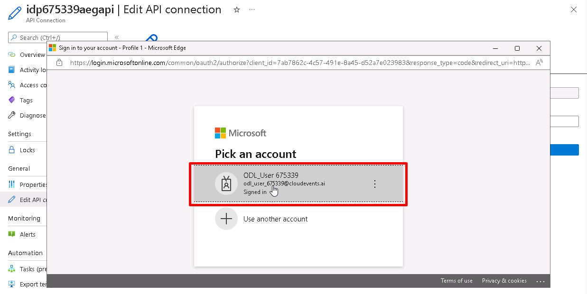

7. **Save** ***(1)*** the connection and check for the notification stating **Successfully edited API connection** ***(2)***.

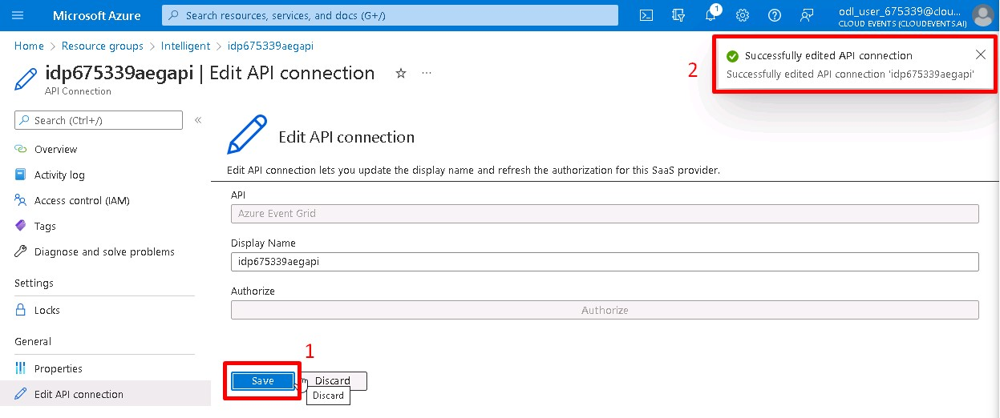

8. Now go back to the **Overview** page and verify if the status shows **Connected**, else click on **Refresh** a few times as there could be some delays in the backend. 

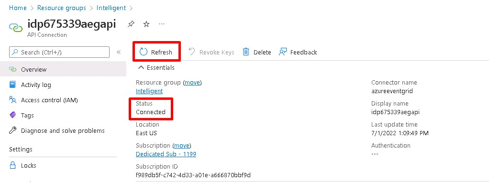

9. When the status shows **Connected**, come back to the PowerShell window and click on any key to continue when you see the message **Press any key to continue**. 

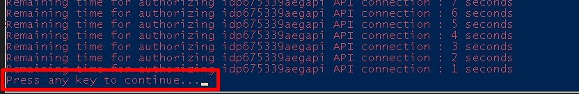

### STEP 2 - Authorize Office 365 API Connection

1. We need follow the same procedure to authorize the Office 365 API as we did for the Event Grid API. We have to authorize the API connection in two minutes. Once you see the message **Authorize idp<$uniqueNumber>o365api API Connection** in yellow, go to **Intelligent** resource group. 

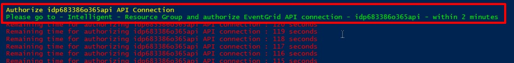

2. Search for the **idp<$uniqueNumber>o365api** resource in the resources search tab and click on it. This will now take you to a API connection page. 

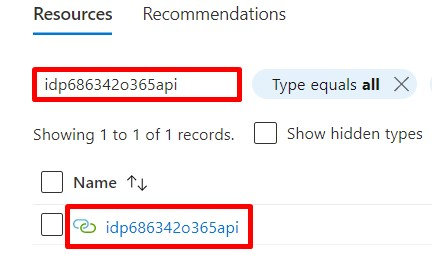

3. In the API connection blade, select **Edit API connection**. 

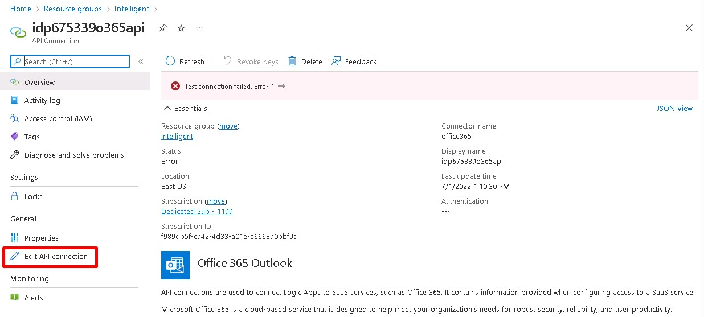

4. Click on **Authorize** button to authorize. 

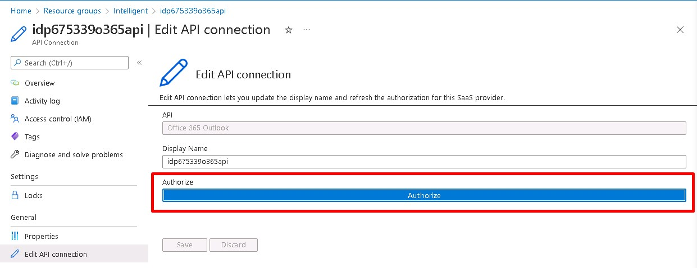

5. In the new window that pops up, select the ODL/lab account. 

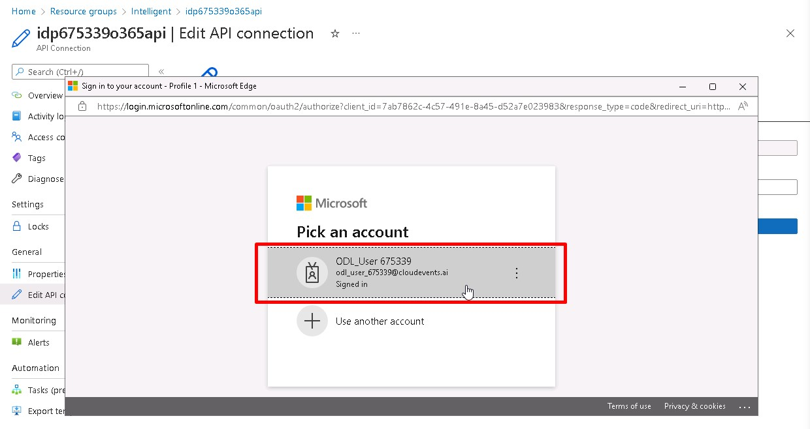

6. **Save** ***(1)*** the connection and check for the notification stating **Successfully edited API connection** ***(2)***. 

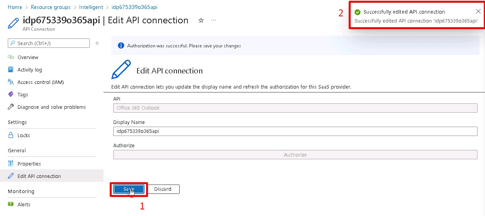

7. Now go back to the **Overview** page and verify if the status shows **Connected**, else click on **Refresh** a few times as there could be some delays in the backend. 

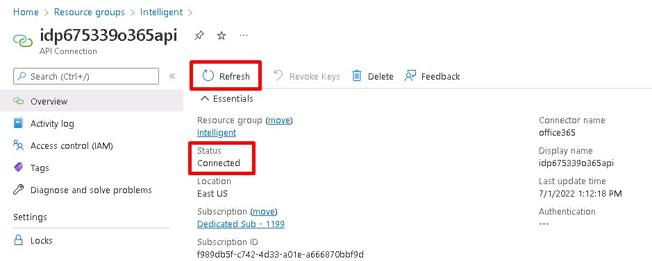

8. When the status shows **Connected**, come back to the PowerShell window and click on any key to continue when you see the message **Press any key to continue**.

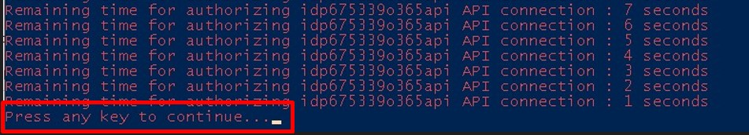

We have now authorized both the API connections. Go back to the PowerShell window and wait for the script execution to complete. Note that the PowerShell window will close once the script execution completes. Please wait for 10 minutes after the PowerShell run is complete, and then proceed to the next step.

## Acessing the Search UI

1. Go back to the **Intelligent** resource group. Then, search and select **idp<$uniqueNumber>webapp**. 

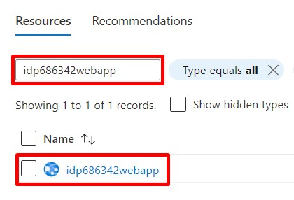

2. In the App service page, click on the **URL** present in the Overview blade. This will open the Search UI/Web app in a new tab. 

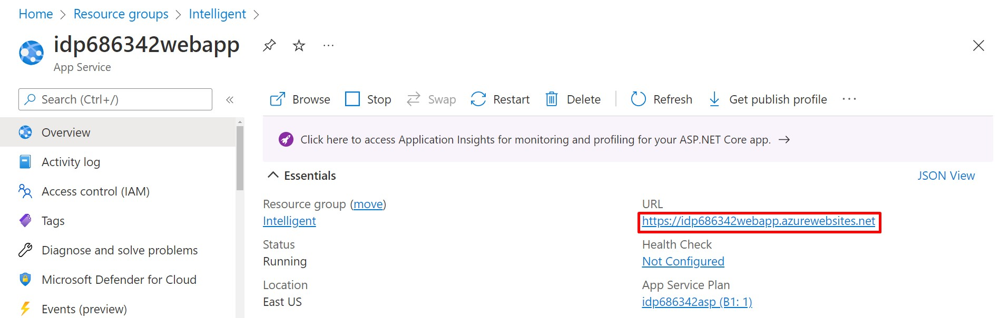

3. A webpage will load. Select **Search** in the top menu bar. 

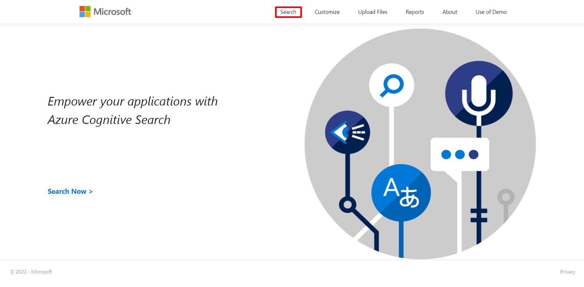

4. Skip the tutorial by clicking on the **Skip Tutorial** popup. 

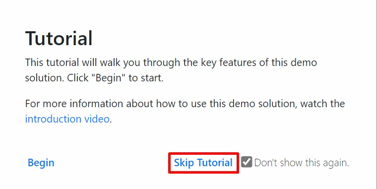

5. You can use the **Search tab** for searching the words from the forms uploaded and even explore each of the text cognitive skills by selecting them. 

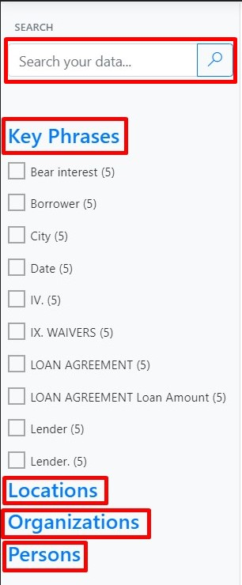

6. We can even upload the files manually to cognitive search. Click on **Upload files** in the top menu bar, this will provide you with a user interface to upload the files. 

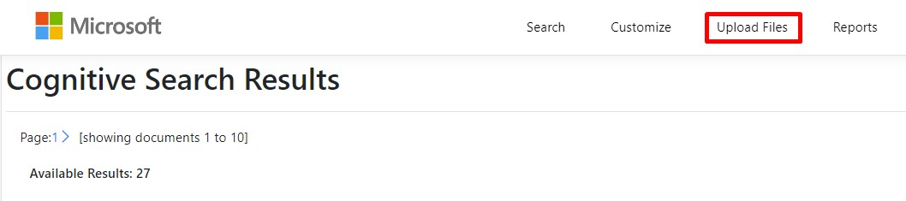

7. Drag and drop files into the red zone to add them to the upload list, or click anywhere within the red block to open a file dialog. 

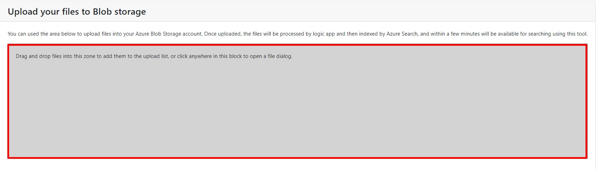

8. Select the file to upload and wait for 5 minutes as the cognitive search enrichment pipeline runs every 5 minutes.

9. You can now go back to **Search** section and search for the word present in the file that was just uploaded.

We have now completed exploring the Cognitive Search UI.

## Creating Knowledge Store and working with Power BI report

### STEP 1 - Creating Knowledge Store

1. In the **Intelligent** resource group, search and select **idp<$uniqueNumber>azs** cognitive search service reosurce.

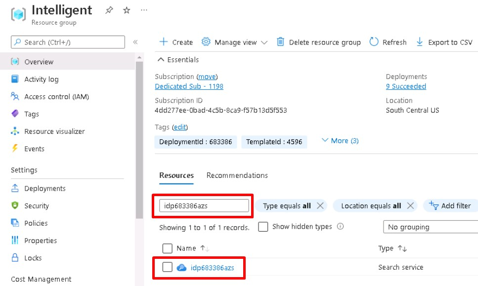

2. In the **Seacrh service** page, click on the **Import data** option which will lead you to a new page.

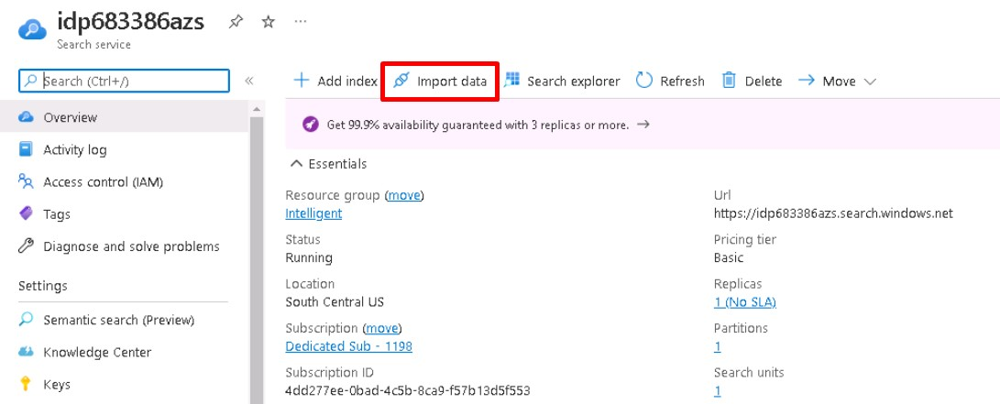

3. Choose **Existing data source** ***(1)*** from the drop down menu, then select the existing Data Source **processformsds** ***(2)*** and click on **Next: Add cognitive skills (optional)** ***(3)***. 

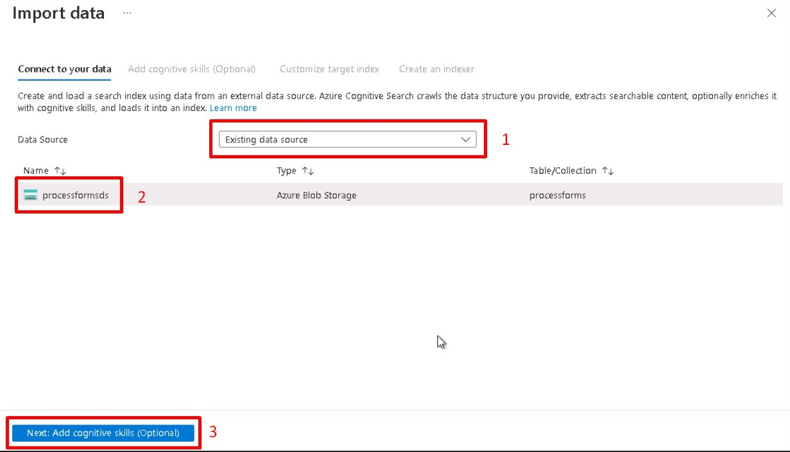

4. Click on the drop down button in the **Add cognitive skills** tab. 

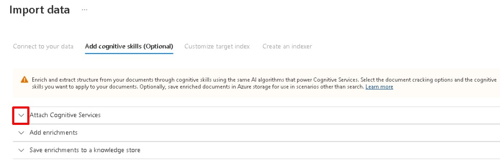

5. Select the **idp<$uniqueNumber>cs** ***(1)*** search service and click on the **Add enrichments** ***(2)*** drop down. 

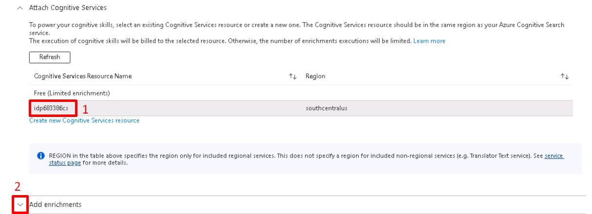

6. Make sure to fill the below details as per the image below
   * Skillset name: **forms<$uniqueNumber>-skillset** ***(1)***
   * Enable OCR and merge all text into **merged_content** field: **Check the box** ***(2)***
   * Source data field: **merged_content** ***(3)***
   * Enrichment granularity: **Pages (5000 characters chunks)** ***(4)***

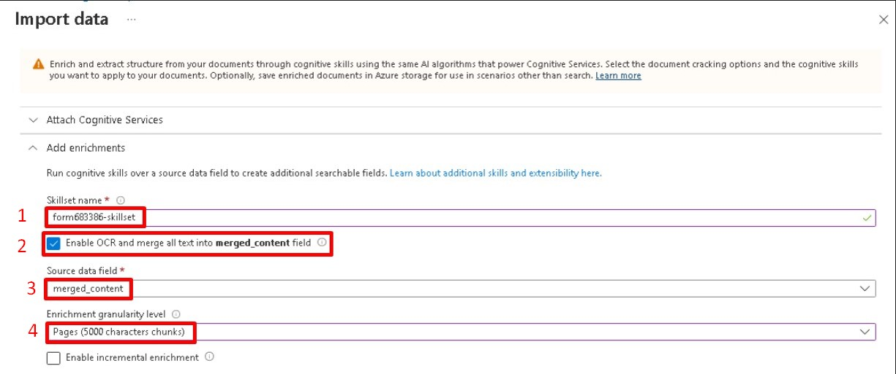

7. Scroll down and select the **Text Cognitive Skills** as per the image below. Then, select the **Save enrichments to a knowledge store** drop down.

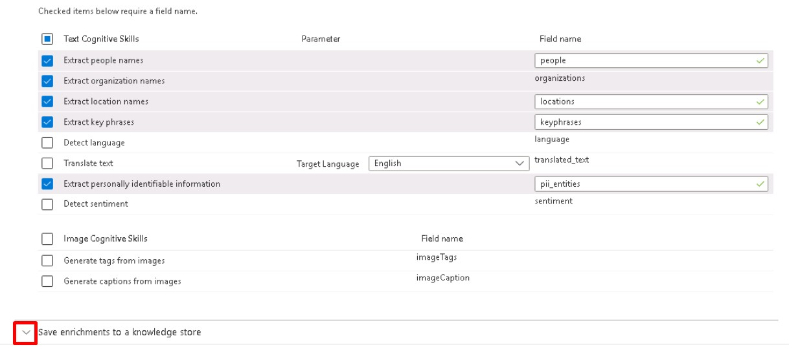

8. In **Save enrichments** drop down, only select the below **Azure table projections**
   * Documents
   * Pages
   * Key phrases
   * Entities
  

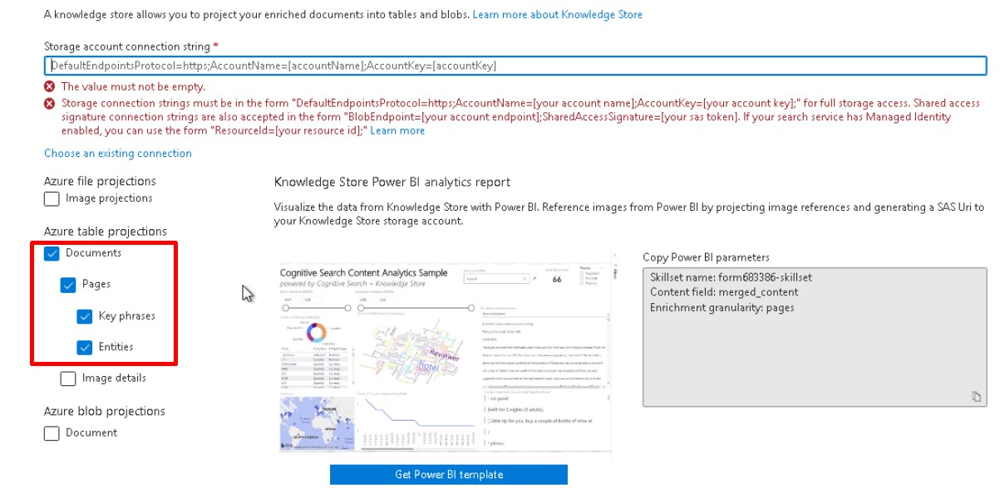

9. Now, we need the connection string of the storage account. Click on the **Choose an existing connection**, this will redirect to a new page to select the storage account. 

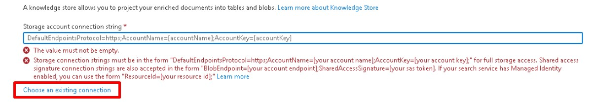

10. Choose the **idp<$uniqueNumber>sa** storage account.

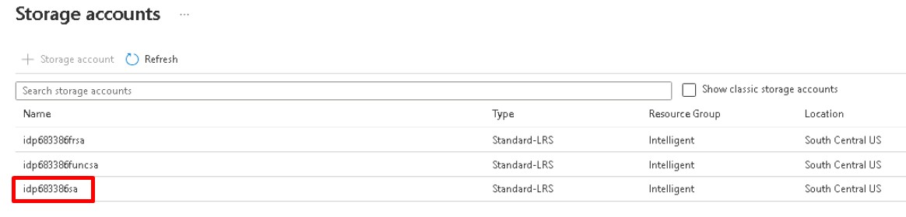

11. Select the container **processforms** ***(1)*** and click on **Select** ***(2)***.  

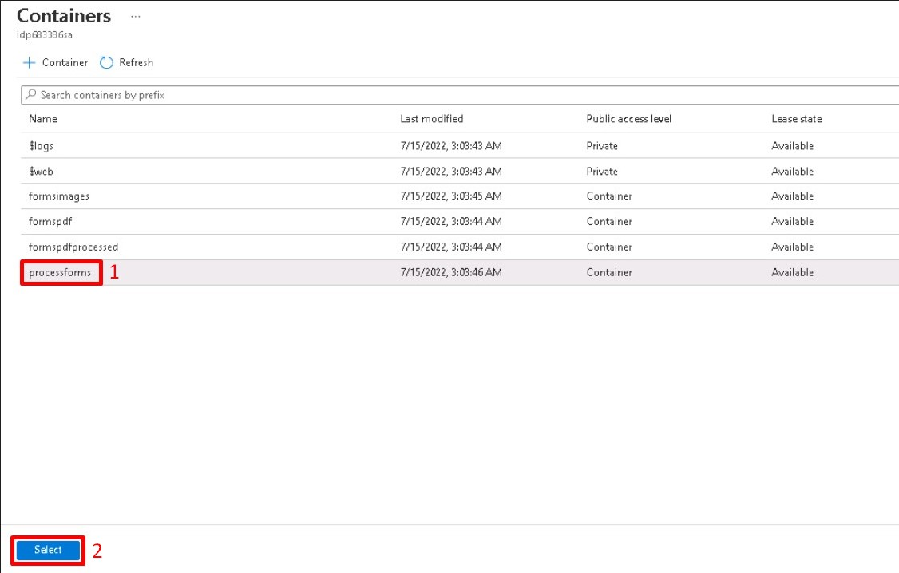

12. Copy the Power BI parameters to a text file and save it, then select **Next: Customize target index**.  

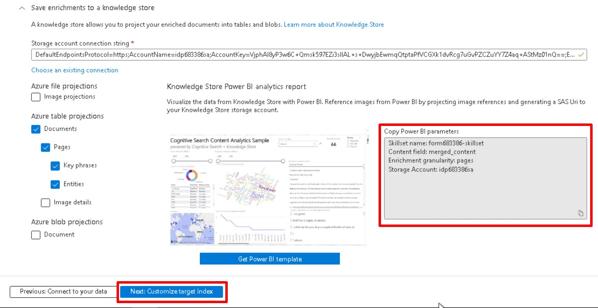

13. In this tab, enter the **Index name** as **forms<$uniqueNumber>-index** ***(1)*** and select **Next: Create an indexer** ***(2)***. 

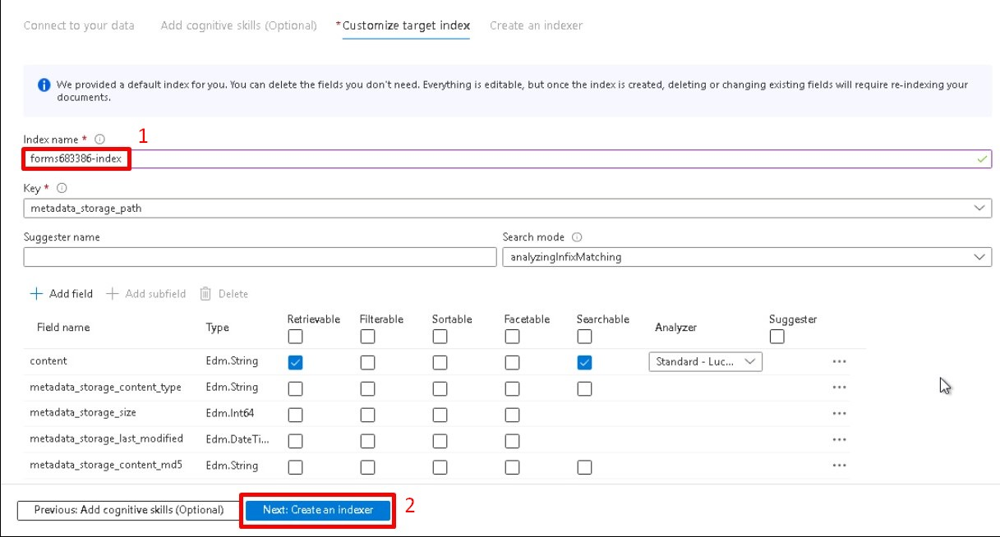

14. Provide the following details for the indexer, 
    * Name: **forms<$uniqueNumber>-indexer** ***(1)***
    * Schedule: **Custom** ***(2)***
    * Interval (minutes): **5** ***(3)***
    * Select **Submit** ***(4)*** to complete the process of creating **Knowledge Store** 

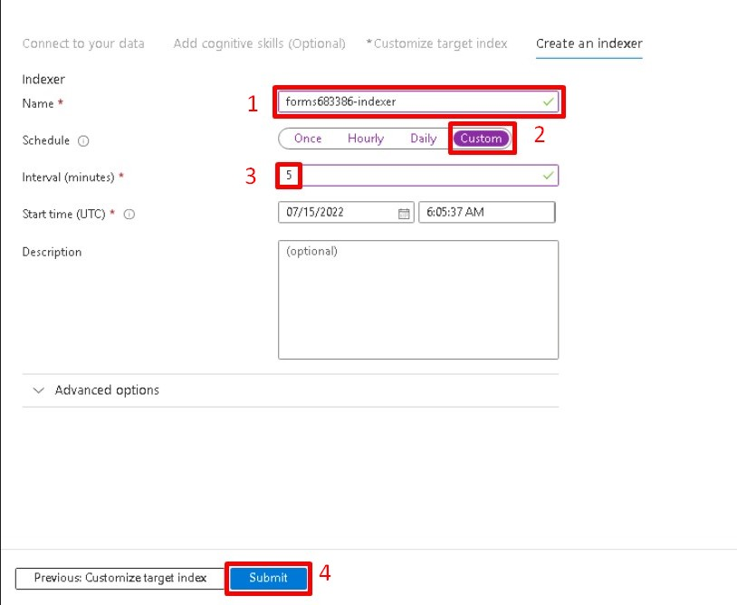

15. Once submitted, click on the **Bell** icon in the top right section of the Azure portal to see the notifications. 

16. Select the text **Import successfully configured, click here to monitor the indexer progress** in the **Azure Cognitive Search** notiifcation. This will redirect you to **Indexer** page.

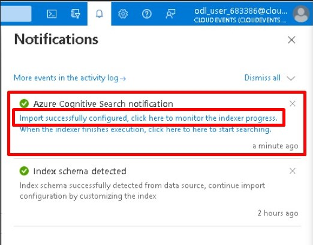

17. In this page, a run would have been **In progress** as in the below image. If you cannot see any run **In progress/Success**, click on refresh until you are able to see it. 

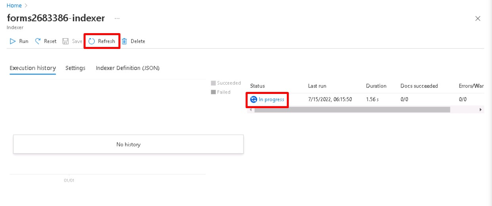

18. After a few seconds the run status should show as **Success**, else feel free to click the **refresh button** until you see it.


We have now configured the Cognitive Search Knowledge Store.

### STEP 2 - Power BI Content Analytics

1. Open the Power BI report in the **D:\LabFiles** directory with name **cognitive-search-content-analytics-template.pbit**.


2. If you get a popup window stating **Couldn't load the schema for the database model** and you are unable to close it like the below image. 


3. Come to the taskbar and close the blank window. 


4. Now go back to the Power BI window and try closing the popup. 


5. Also close the **Collaborate and share**, and **Formatting just got easier** popups, if you get any. 


6. If you get a Power BI popup seeking for subscribing, please select **Maybe later** and then click on **Close**.


7. A popup with name **cognitive-search-content-analytics-template** will showup. Fill in the Power BI parameters that you previously copied according to the respective fields. 


8. To get the **StorageAccountSasUri**, please revert back to **Intelligent** resource group in Azure. Then search and select **idp<$uniqueNumber>sa** storage account. 


9. Scroll down in the storage account left blade and select **Shared Access Signature** under **Security + networking**.


10. Check all the check boxes as shown in the below image.


11. Set the expiry date to next day and select your **Timezone** ***(1)***. Choose the Allowed protocols as **HTTP & HTTPS** ***(2)*** and click on **Generate SAS and connection string** ***(3)***.


12. Copy the **SAS token** and paste it in the Power BI popup window under **StorageAccountSasUri** and click on **Load**. 


13. Another popup window might appear seeking storage account key. Go back to the storage account and in the left blade, search for **Access Keys** and select it. 


14. Click on **Show keys** and copy the first key. 


15. Paste the copied key in the Power BI popup seeking it and select **Connect**.


16. A new popup with name **Refresh** will show up. Click on the **Continue** button that will appear.


17. Wait for a few seconds for the report to load. Select the below **CognitiveSearch-KnowledgeStore-Analytics** tab and go through the above contents. 


18. Select the below **Keyphrase-Graph-Viewer** tab and go through the above contents. 


We have now explored Power BI Cognitive search content analytics report.
